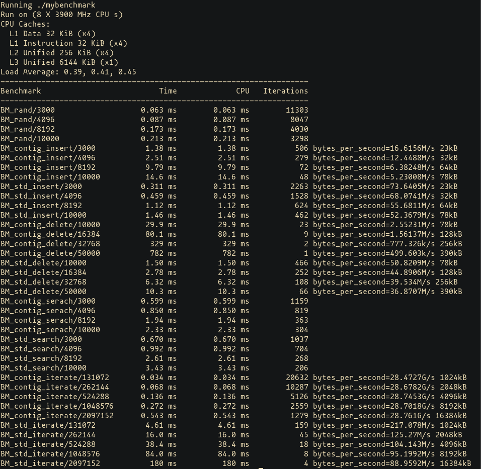

# contiguous_map_benchmark
Performance comparison between std::map and ContiguousMap using Google Benchmark
* insertion
* search
* iteration

Format: 
<benchmark_function> / <data_structure_size> ------- TIME ------- CPU TIME ------- <speed_on_single_pass>

